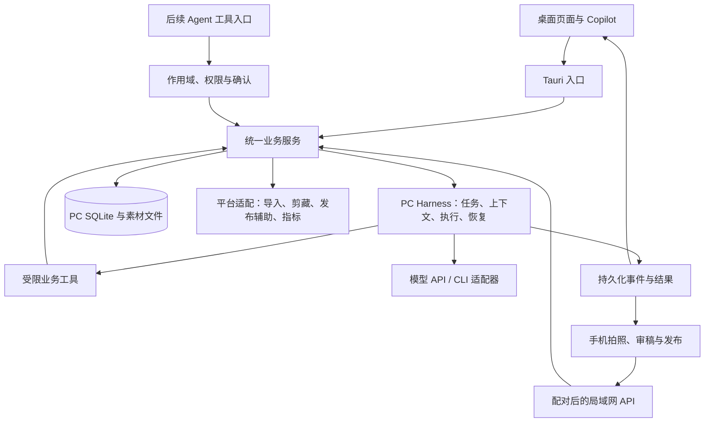

# 爱吃红薯：产品 Roadmap 与整体架构规划

日期：2026-09-21。状态：整体方案持续细化；PC 导航与 AI 三形态方向已确认，具体交付见 [Luna 执行计划](./2026-09-21-PC整合与统一AI-Luna执行计划.md)。本文不代表已交付能力。

## 0. 恢复检查点与授权边界

- 本轮任务：梳理产品全景、移动端、Copilot/Agent、记忆、账户演进与安全运营路径，形成可评审方案。
- 用户已确认：首期手机与 PC 同一 Wi-Fi；手机审稿后辅助交接到小红书 App，用户最终提交并回填/核对结果；以用户自己的租房家居账号和真实工作流作为首个验收样板。
- 用户明确：虚拟账户与共享资产是未来方向，本期只预留口子。
- 本轮完成：只读核对桌面/移动/NOOMD 相关代码，查看官方分享 SDK、账号接口、浏览器权限与移动分享文档，整理本方案。未运行应用、未安装 SDK、未操作平台账号或正式数据。
- 基线：`42a5095` 加工作区既有修改。已有 db.rs、lib.rs、local.ts、Inspire.tsx、Publish.tsx、package.json、浏览器脚本、导航与 CHG 文档修改；browser-extension、browser_capture.rs 等未跟踪；MediaCrawler 子模块脏状态。全部保留。
- 本轮修改：仅新增本文、在文档导航增加入口；不修改现有 CHG 的授权、技术决定或交付状态。只读调研和文档整理不新建 CHG。
- 最新交接：已按用户决定修正实施顺序并补充 Luna 执行计划；下一步由用户交付 Luna，从 A00 开始，实施前建立对应确认卡、技术设计和检查点。既有 CHG-20260916-001 继续负责已经授权的迁移与验收，新增跨端/记忆范围单独明确，避免混进迁移任务。
- 尚待验证：手机真实系统及安装条件、LAN 加密与配对实现、多模态 Provider、相册顺序与分享交接、官方 SDK 审核资格、可授权的数据接口范围。PC 离线采集暂为建议，用户尚未单独确认。
- 五类落点：本轮无功能实施，产品事实、技术事实、发布说明、用户手册和完成变更记录均不更新为新能力；旧移动设计仍作历史参考，其独立运行方向不能覆盖本次已确认的 PC Harness 方向。

## 1. 产品目标与边界

产品定位：帮助租房家居创作者，把自己的照片、真实经历和个人表达，持续转化为可发布、可复盘的内容。

第一验收用户是项目使用者本人。先证明比“手机拍照 → 豆包对话 → 复制与选图发布”的现有流程更省整理和重复解释，之后再验证其他创作者需求。

北极星指标候选：每周完成发布并完成一次反馈记录的有效笔记数。配套记录单篇主动操作耗时、事实纠正次数、流程卡点、素材找回成本、次周复用情况。首次使用前先记录原流程基线；不把模型生成数当成果，不以少量笔记涨粉证明因果。

首期包含：图文笔记、单个实际账号验证、手机输入与审稿、PC 执行、人工最终发布、手工反馈即可跑通复盘。

远期预留：共享资产服务多个运营身份、跨页 Agent、受控定期监控。公网远程、PC 离线执行、无人值守发布、视频编辑、团队权限和技能市场暂不纳入首期。

## 2. 产品全景：业务闭环

| 环节 | 必需的小节点 | 业务产物/完成证据 |
| --- | --- | --- |
| 定位 | 目标受众、生活背景、表达偏好、内容边界、目标与更新节奏 | 可编辑的账号定位卡 |
| 收集 | 手机照片与主题、经历补充、来源记录、去重、顺序、缺失信息 | 素材与事实卡 |
| 选题 | 关联历史事件、已有笔记、评论问题、所缺素材、排期 | 有依据的选题 brief |
| 生产 | 图片理解、标题/正文/标签、配图顺序、封面选择、版本修改 | 结构化可编辑稿件 |
| 审核 | 事实与推测、图片匹配、人设、重复表达、平台要求 | 已审稿版本与未决问题 |
| 发布 | 固定版本、目标账号确认、复制与导出、跳转、失败恢复 | 发布任务与交接记录 |
| 回填 | 用户确认、URL/笔记 ID、实际发布时间、平台内容核对 | 发布记录及证据来源 |
| 监控 | 指标来源、采集时间、观察窗口、缺失值、评论问题 | 不覆盖历史的指标快照 |
| 优化 | 与自身同类型内容比较、改进假设、后续选题 | 下一轮可执行任务 |

桌面信息架构已定向为：概览、素材库、灵感、笔记、账号；全局搜索放 LOGO 下；账号池和设置独立保留。选题/榜样归灵感，发布归笔记，数据归账号。细节以 Luna 执行计划为准。

手机信息架构建议：随手拍/输入、进行中的任务、审稿与发布；保留连接状态及必要设置。初期无需镜像所有桌面页签。

## 3. 当前架构事实与缺口

| 证据入口 | 观察 | 规划含义 |
| --- | --- | --- |
| `client/src-tauri/src/db.rs`、`lib.rs` | 当前约 5917/939 行；数据、命令、AI 进程能力集中 | 按业务逐步抽取服务，不做一次性重写 |
| `client/src/hooks/useAIStream.ts` | 页面上下文与对话拼接；历史包含 localStorage 持久化；已有运行记录/产物机制 | 可复用已有能力，但跨端任务不能依赖某个 WebView 的历史 |
| `client/src-tauri/src/lib.rs` | 本地 CLI Provider 的 image/tools 标志为 false；提示词要求不执行命令 | 图片理解是首个切片的真实依赖；提示词限制不能替代执行权限 |
| `mobile/drizzle/schema.ts`、`services/ai.ts` | 独立 SQLite、独立人设和直接模型调用 | 现有手机端还不是 PC 的 Companion |
| `mobile/services/media.ts`、`create/publish.tsx` | 已有相册/选图/复制/发布辅助代码 | 优先复用原生入口，真实设备仍需验证 |
| `mobile/services/publishProgress.ts` | 记录复制、导出进度 | 不等于平台发布成功，需要正式发布回执 |
| 当前 CHG 的 N12/N13 | 剪藏链路、发布 outbox/准备已有实现，真实路径仍有待验收项 | 在既有状态机上演进，避免新建平行发布系统 |

旧移动技术设计强调纯本地、不同步；本轮用户已明确首期使用 PC Harness，因此新连接模式应以 PC 为正式数据来源。旧手机数据不能丢弃，迁移需显式预览、去重与可恢复导入；未实施前原模式继续保持现状。

## 4. 目标架构：PC 统一运行，手机轻量接续

Harness 的职责：组装上下文、调用模型、执行业务工具、持久化进度、等待确认、处理取消/超时/中断、返回产物。不是泛化远程终端。

### 4.1 业务和传输分离

- 保留 Rust/SQLite 本地基础。把账号、资产、笔记、发布、记忆、任务的业务校验抽成服务；Tauri command 和 LAN API 都调用它们。
- 初期局域网服务随桌面运行，只在用户开启手机连接后监听；不要求另起 Python 服务。桌面退出/电脑休眠时手机明确显示不可用。独立后台进程以后再评估。
- 不把 Tauri invoke、整个数据库、任意 shell 或文件系统接口直接暴露到 LAN。手机只获得上传、读写授权稿件、运行/取消任务、读取结果、发布回填等有限能力。
- 手机与桌面传输不同，但命令/事件 DTO、错误码、版本冲突语义一致；用契约生成或校验避免两端手写漂移。React Native 与桌面只共享合适的类型/纯逻辑，不强行共享全部 UI。
- 网络调用不持有数据库长事务。AI/平台调用先建任务，再在短事务中保存结果。

### 4.2 配对与恢复

- 建议使用 PC 展示的一次性配对码/二维码与人工设备确认，随后签发可撤销、有限作用域设备凭证；拒绝未配对请求。同一 Wi-Fi 不是身份认证。
- 建议原生客户端使用带设备信任校验的 TLS；证书指纹可通过配对二维码核对。具体实现必须先做真机验证，不以“忽略证书校验”作为产品方案。
- 主机凭据留在 PC；设备令牌进入手机安全存储；网页来源和 Host 校验、上传类型/大小/路径校验、请求限额作为边界。
- 每次写操作携带 requestId、对象版本和明确账号作用域。重连重试不重复建稿，不因桌面切换账号把手机任务写入其他账号。
- 流式事件带任务 ID 和递增序号，手机可按游标补取；原生端可先用轮询实现正确恢复，之后优化流式体验。
- 建议 PC 离线时手机仅保存待上传照片和文字，不生成第二份正式稿；恢复后显示待发送清单，用户确认再发送。此离线缓冲能力尚未单独确认，可移到后续。

### 4.3 手机形态选择

推荐先复用已有 Expo 手机端做 Companion 模式：相册、选图、复制和发布辅助已经有基础，适合用户真实流程。首期按现有 iOS 工程优先验证，用户实际系统/设备仍需核对。

轻量移动网页可用于后续预览/审稿入口，但不默认等同完整发布体验。Web Share 需要安全上下文，手机访问 PC 的普通 LAN HTTP 地址不能直接当作 HTTPS 或手机 localhost；平台接收能力和图片顺序也需要实测。[Web Share 文档](https://developer.mozilla.org/en-US/docs/Web/API/Navigator/share)、[安全上下文](https://developer.mozilla.org/en-US/docs/Web/Security/Defenses/Secure_Contexts)

原生客户端也有安装签名、局域网权限、证书配对和系统兼容成本；第一技术验证应先证明“手机传图 → PC 处理 → 手机取回有序图片和文案”。Expo 相册访问/保存存在官方能力依据，但本项目 SDK 56 需按锁定版本核对，不能直接照搬 latest 示例。[Expo MediaLibrary](https://docs.expo.dev/versions/latest/sdk/media-library/)

## 5. Copilot、Agent 与模型接入

### 5.1 同一助手，按页面提供上下文

| 页面 | 默认上下文 | 第一批有用操作 |
| --- | --- | --- |
| 资产 | 选中图片、物品事实、来源、关联经历 | 解释图片、补全待确认字段、找旧素材 |
| 选题 | 人设、历史内容、素材缺口 | 建议主题、生成 brief、关联素材 |
| 笔记 | 当前版本、选图、已确认记忆 | 修改并展示差异、生成标题、检查事实 |
| 发布 | 审核版本、目标身份、交接状态 | 发布前检查、准备发布包、解释卡点 |
| 复盘 | 同口径指标、观察窗口、评论 | 提出改进假设、转成下一篇任务 |
| 账号/记忆 | 定位、有效记忆、来源与冲突 | 更新建议、过时信息提醒、纠错 |

页面变化更新 context，但不自动把无关任务混为同一个会话。用户能看到本次引用的素材/记忆，并能排除。

### 5.2 分层执行能力

- L0：解释、检索、建议；不改业务对象。
- L1：结构化生成/修改，用户可审阅差异、应用、撤回。
- L2：用户授权目标后，Agent 调用业务工具串联选题、素材、稿件和发布准备；明确预算、步数、停止条件。
- L3：已配置计划的内部任务自动执行，必要时等待人确认；正式平台提交继续保留人工。

候选工具：search_assets、read_memory、propose_memory、create_brief、propose_note_patch、apply_note_patch、prepare_publish、record_publish_receipt、record_metric_snapshot。名称仅表达契约方向，不代表已实现。

每个工具声明输入 schema、账号/资产范围、读写性质、幂等条件、产物和审批要求。抓取的网页、历史稿和评论是资料，不得升级为可授权指令。审批绑定目标对象及版本，稿件变化后旧发布批准失效。

NOOMD 本地 `agent_runtime.rs` 已有结构化请求、附件、工具事件、运行管理，以及知识检索/读取/编辑工具；可借鉴这些边界。其 Markdown 编辑模型不能直接替代本项目的笔记、账号与发布业务。Beav 也展示了结构化 Agent 通道与用户工作台分离的思路。[Beav Agent](https://www.getbeav.com/agent)

### 5.3 首期必须验证多模态

当前桌面文本 CLI 可用不能证明图片理解可用。M1 必须选定并验证至少一条真实图片能力：PC 模型 API 或已验证的 CLI 图片输入；必要时“图片理解 + 文本生成”分工。未验证 Provider 明确标为不支持，不把图片文件路径当成模型已经看过图片。

CLI 适配需验证执行权限、工作目录、工具禁用、取消与超时。仅提示“不执行命令”不构成权限隔离；在收敛前不能将普通文本 CLI 作为手机任意执行入口。

## 6. 个人定位与记忆

### 6.1 记忆层次

1. 定位和表达：目标读者、主题边界、口吻、禁用表达。
2. 生活事实：租房空间、物品、实际尺寸/价格/材质、使用约束。
3. 事件：购买、踩坑、退货、替换、长期使用反馈，带发生时间。
4. 内容历史：已审稿、已发布版本、引用来源、系列关系。
5. 工作记忆：本次意图、暂定修改、待确认问题，任务结束后不直接升格为长期事实。

建议基本字段：内容、scope、subject、source、source_type、发生/记录时间、确认状态、有效状态、替代关系。候选/已确认/已否定/已过时分开；允许查看、修改、删除及重建检索索引。删除记忆后新任务不再检索该项；历史产物保留其当时版本记录并标明已撤回来源，不能伪装为实时有效事实。

检索先做作用域与状态过滤，再按相关性/时间选择；首期结构化查询与全文检索即可，向量检索不是起步前提。有限上下文拼接，记录本次实际引用的版本，不把全部历史聊天永久塞进提示词。

### 6.2 样例验证

- 门后置物架：区分旧塑料款与新金属款，保留“踢脚线卡住 → 更换 → 包包收纳”的事件关联；不能把旧物品缺点套给新物品。
- 油烟机：用户输入为事实候选；旧 AI 稿新增的“漏烟/倒灌”等未确认推断不能成为记忆事实。
- 台风宅家：主题与生活场景可关联，但稿件描写不能无条件证明实际存在所有物品。
- 历史例文先拆为用户输入、AI 稿、用户修改、发布版本；缺失的信息明确未知。不得从助手结尾问句生成待发布正文。
- 月日没有年份的样例保留原始日期精度，不自动补成年份或用于精确时间统计。

记忆初始导入由用户挑选少量历史内容，生成可审核的定位卡、事实卡和事件链；不需要自动登录或抓取豆包会话。

## 7. 账户与共享资产：只预留

概念模型建议：Workspace（资产空间）→ Persona/Channel（运营身份）→ PlatformBinding（真实小红书账号绑定）；BrowserConnection 独立管理登录会话。

Asset 的物理存储与账号访问授权分离，Note/Plan/Publication 归属于明确运营身份；共有事实按授权复用，语气、策略、草稿和效果属于账号上下文。虚拟账号可以暂时没有真实绑定。

用户明确的是共享资产和多账号生成方向；“虚拟运营身份”的完整定义仍待未来设计确认。本期不新增虚拟账户 UI、不自动合并素材、不解除现有账号隔离。

现在只做接口/类型边界：请求显式传作用域，任务创建后固定身份；避免用全局 active_account 作为执行依据。未来迁移先将旧账号映射为独立私有空间/身份，维持原可见性，用户再显式共享；共享素材的引用和删除需保护所有引用方。暂不为未来功能大规模迁移业务表。

## 8. 发布与安全运营路径

### 8.1 发布状态与回执

建议在现有 outbox 上表达：草稿 → 审核通过 → 发布包已准备 → 已交接 → 用户确认已发布 → 平台结果已核对；另外有取消、失败、结果不明。

复制正文、导出图片、打开 App、SDK 返回成功均不直接代表平台笔记已发布且可见。用户回填记录 confirmation_source=user；取得匹配平台证据后再提升状态。保存账号、稿件版本、素材顺序、发布时间、URL/平台 ID 和核对来源。平台编辑后的内容可与发布快照对比，不覆盖原始证据。

首期：复制标题/正文、按明确清单导出图片、用户进入小红书选图发布，返回回填链接。相册导出顺序与小红书选图顺序不能直接画等号，需用缩略图顺序预览和真机步骤验收。交接中断可继续；结果不明时先核对，不盲目再次发布。

官方分享 SDK 可作为后续优化：iOS 文档要求申请 AppKey、权限审核、相册权限与 Universal Links 配置；不预设个人项目一定获批。已查看文档标注更新时间较早，实施前核对实际 SDK 包与最新审核要求。[官方 iOS SDK](https://agora.xiaohongshu.com/doc/ios)

### 8.2 采集与监控分级

| 路径 | 首期用途 | 边界/降级 |
| --- | --- | --- |
| 用户输入、截图、已有导出文件 | 自己账号指标与评论问题回填 | 保存来源、时间和待确认字段；无导出能力时手工填写 |
| 官方授权接口 | 优先评估符合权限的能力 | 已查看账号 API 主要覆盖授权和基本信息；不能据此假设有笔记/评论/经营指标接口 |
| 用户主动打开页面并剪藏 | 对标资料与可见内容 | 沿用扩展最小权限，保存范围可见，不等同于平台许可证明 |
| 受控会话读取 | 后续验证限定目标的数据更新 | 沿用已有 D4 混合方向；权限和真实稳定性验证后启用，首版不依赖其完成闭环 |

资料：[官方账号 API](https://openaccount.xiaohongshu.com/docs/api-reference)、[Chrome activeTab](https://developer.chrome.com/docs/extensions/develop/concepts/activeTab)。activeTab 解释浏览器临时授权机制，不证明小红书认可采集，也不保证账号安全。

工程控制建议：每账号串行、任务去重、最少必需字段、可见目标清单、请求预算、退避、取消、缓存；登录失效、验证挑战、拒绝访问、限流或异常空数据时暂停相应连接并交给用户。保留上次快照并标“过期”，不把失败记为零。不得因失败自动切号绕过限制。

本次未找到官方可证明安全的每分钟/每日采集阈值；现有 D4 文档“几十条/次”“随机间隔”“封号主因”等表述不能作为已证实结论。本规划不改变已授权的路线 C，但不沿用其无来源的安全评级。反检测依赖仍按既有决定暂不引入。

两个尝试访问的旧用户协议地址失效，本轮没有完成最新社区采集条款的直接核验。因此不能给出采集许可或封号概率结论；真实采集上线前补核验当前入口和适用权限。MediaCrawler 保留项目既定学习研究边界，不作为商业交付采集依赖直接打包。

### 8.3 复盘先闭环，再自动化

初期支持手工录入自己笔记的点赞/收藏/评论等实际可获得指标，曝光/阅读只有有来源时填写；空值不是 0。记录 observed_at、published_at、source、metric_definition，按相同发布后时长比较。

先建议在发布后 24 小时和 7 天回顾；这是产品观察窗口候选，不是平台安全采集频率。PC 睡眠错过任务后只补取一次当前值，不伪造当时的 24 小时历史值。

复盘输出应包含观察、证据、局限、下一次实验。例如“后续解决方案类是否比单次吐槽更适合本账号”，不能凭单篇数据断言因果。评论先提炼问题形成选题，不自动回复、点赞或私信。

## 9. Roadmap 与验收门槛（按最新用户决定更新）

用户已指定 PC 页签整合 → AI 全面重构 → 手机端 → 自动化深化。原先优先做手机切片的 M0–M4 顺序及人周估算撤回；以本节和 [Luna 执行计划](./2026-09-21-PC整合与统一AI-Luna执行计划.md) 为准。

| 阶段 | 交付 | 门槛 |
| --- | --- | --- |
| A：PC 整合 | 概览、素材库、灵感含选题/榜样、笔记含发布、账号含数据；LOGO 下全局搜索，账号池保留 | A00–A06：既有流程可达、无数据与功能回退、完成原生验收 |
| B：统一 AI | Model API/Agent CLI；浮窗/侧栏/独立页面；统一上下文、任务、最小记忆与业务工具 | B00–B07：跨形态同一运行，隔离、恢复、图片能力与受控修改验证 |
| C：手机接入 | 同 Wi-Fi 使用 PC Harness，拍照、对话、审稿、发布交接和回填 | 两端同一任务，无丢稿/重复执行，真实设备发布流程验收 |
| D：自动化深化 | 指标更新、运营计划、受控跨页 Agent | 权限与停止条件明确，监控失败可降级，正式提交仍人工 |
| Later | 虚拟身份、共享资产 | 本期只留接口，具体需求和迁移另行确认 |

PC 整合阶段保留既有 AI 入口；统一 AI 阶段逐步迁入。手机接口与任务持久化在 B 阶段设计，但不提前扩大到 LAN 或手机实施。详细 AC 见 Luna 执行计划；下节保留全产品长期验收样例，不全部纳入第一批。

## 10. 验收样例与停止条件

| AC | 操作 | 可观察预期 |
| --- | --- | --- |
| AC-01 | 未配对手机访问；配对后上传多图和主题 | 未授权被拒绝；配对后仅目标空间可见，原顺序和素材完整 |
| AC-02 | 手机提交生成后切后台/断 Wi-Fi，再回来 | 任务不重复创建，重连能看到现有进度或完成产物 |
| AC-03 | 用门后置物架历史生成后续稿 | 区分两件物品，只引用已确认经历；可查看引用来源 |
| AC-04 | 导入油烟机用户描述和 AI 例文 | “漏烟”等扩写不自动作为事实；助手问句不进入正文 |
| AC-05 | 两端同时修改同一稿件 | 版本冲突提示并可恢复，不静默覆盖 |
| AC-06 | 审稿、导出、手动发布、回填 | 图片和稿件版本一致；导出不误标发布，回填在 PC 可见 |
| AC-07 | 取消 AI、重启 PC、切换桌面账号 | 有明确中断/取消状态，手机任务保持原账号，不自动重复执行 |
| AC-08 | 指标未取得或采集失败 | 显示未知/过期并保留历史，不写入虚假零值 |
| AC-09 | 修改/撤回长期记忆 | 后续任务使用新状态，历史引用可追踪，不污染其他身份 |
| AC-10 | 从复盘建议创建下一选题 | 保留依据、目标和待验证假设，能继续进入生产任务 |

以上全部是拟议验收项，当前未执行。原生相册、局域网权限、证书、返回 App、图片顺序和真实发布必须在用户设备验收，构建通过不能替代。发布操作仍由用户完成。

停止/降级条件：找不到可靠多模态能力则不能宣称替代原拍照流程；SDK 未获批就保持人工交接；数据采集权限或稳定性不足就维持人工反馈；PC 不在线不假装后台任务仍在执行；出现账号作用域串写或正式数据迁移不确定，暂停相关写操作并保留恢复资料。

## 11. 调研证据与局限

本地证据：README、当前 CHG 确认卡/设计/实施记录/N00/D4、桌面 db.rs/lib.rs/useAIStream/localAi、mobile README/schema/ai/media/publishProgress/publish 页面；NOOMD 的 AGENTS 与 agent_runtime.rs。均为只读核对，不等于真实产品验收。

在线资料核对日期 2026-09-21：

- [Beav Agent](https://www.getbeav.com/agent)：参考结构化任务接口与用户工作台分工，未安装实测。
- [小红书 iOS 分享 SDK](https://agora.xiaohongshu.com/doc/ios)：确认申请、审核、相册及分享入口，未验证本项目资格和实际回调语义。
- [小红书账号 API](https://openaccount.xiaohongshu.com/docs/api-reference)：已查看接口目录；不能推出拥有内容/指标采集权限。
- [Chrome activeTab](https://developer.chrome.com/docs/extensions/develop/concepts/activeTab)：浏览器临时页面访问边界。
- [MDN Web Share](https://developer.mozilla.org/en-US/docs/Web/API/Navigator/share) 与 [Secure Contexts](https://developer.mozilla.org/en-US/docs/Web/Security/Defenses/Secure_Contexts)：移动网页能力约束。
- [Expo MediaLibrary](https://docs.expo.dev/versions/latest/sdk/media-library/)：相册能力参考，实施按 SDK 56 锁定版本复核。

没有取得：平台内部风控阈值、封号概率、面向本项目获批的指标 API、真实设备连通/分享验收证据。本文对此保持未知，不用第三方“防封经验”替代依据。
