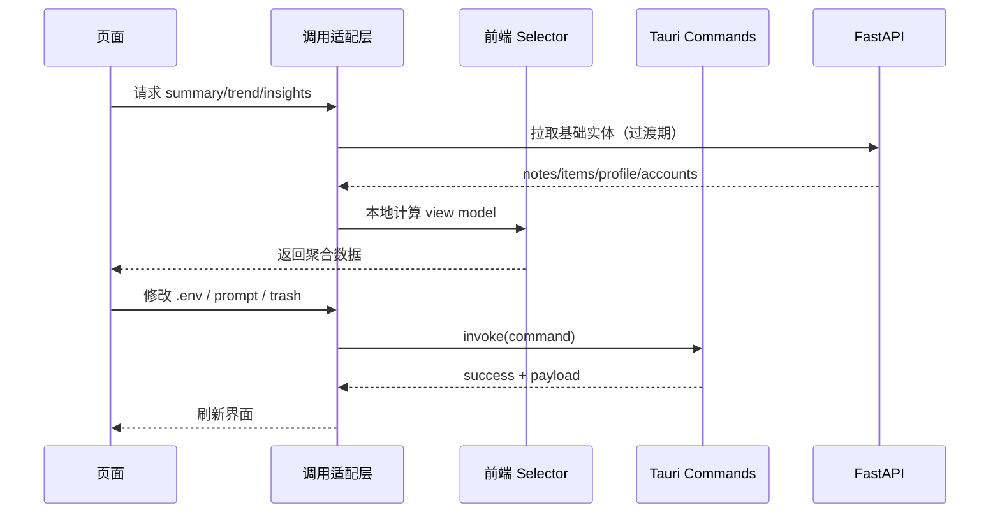

# 前端 Selector 与 Tauri Command 改造方案

> 目标：在不破坏当前业务能力的前提下，逐步把“可前端完成的逻辑”从 HTTP API 下沉到前端与本地命令层。

---

## 1. 改造目标

### 1.1 业务目标

- 减少前端对 `http://127.0.0.1:8765` 的依赖面。
- 保留 AI、爬虫、自动发布等重能力在 Python 后端。
- 提升页面交互响应速度（减少不必要的网络往返）。

### 1.2 技术目标

- 新建前端 selector 层承接聚合统计。
- 新建 Tauri command 客户端承接本地系统能力。
- 形成 `frontend-compute` / `native-local` / `python-runtime` 三层边界。

---

## 2. 改造范围

### 2.1 第一批（P0，2~4 天）

- Dashboard / Data / Inspire / Knowledge 的聚合逻辑前端化。
- 保留原 analytics API 作为兜底，先灰度切换。

### 2.2 第二批（P1，3~5 天）

- Settings（env/prompts）迁移到 Tauri command。
- Notes 的 `open-stage-dir` 迁移到 Tauri command。
- Library 的 trash 操作迁移到 Tauri command。

### 2.3 第三批（P2，按需）

- 评估 `content/library/profile/accounts` 基础 CRUD 是否值得迁到 Tauri + SQLite。

---

## 3. 前端 Selector 设计

## 3.1 目录规划

新增目录：

- `client/src/selectors/analytics.ts`
- `client/src/selectors/topics.ts`
- `client/src/selectors/knowledge.ts`
- `client/src/selectors/index.ts`

新增类型目录：

- `client/src/types/analytics.ts`

---

## 3.2 数据输入与输出约定

输入实体（来自现有基础查询）：

- `notes`
- `items`
- `profile`
- `reference_accounts`

输出模型：

- `SummaryViewModel`
- `TrendViewModel`
- `InsightsViewModel`
- `TopicsViewModel`

要求：

- 输出字段命名尽量与旧接口兼容，降低页面改造成本。

---

## 3.3 核心函数草案

```ts
// client/src/selectors/analytics.ts
export function buildSummaryVM(input: {
  notes: Note[];
  items: Item[];
  profile?: Profile | null;
  accounts: ReferenceAccount[];
}): SummaryViewModel;

export function buildTrendVM(notes: Note[], opts?: {
  granularity?: "auto" | "day" | "week";
  lookbackDays?: number;
}): TrendViewModel;

export function buildInsightsVM(input: {
  notes: Note[];
  accounts: ReferenceAccount[];
}): InsightsViewModel;
```

```ts
// client/src/selectors/topics.ts
export function buildTopicsVM(notes: Note[], limit?: number): TopicsViewModel;
```

```ts
// client/src/selectors/knowledge.ts
export function buildRuleCardsVM(notes: Note[]): RuleCard[];
```

---

## 3.4 接入方式（页面）

以 Dashboard 为例：

1. 先保留原 `analytics/summary` 请求。
2. 同时接入基础数据查询（`content`, `library`, `profile`, `accounts`）。
3. 本地 selector 计算出 `summaryVM`。
4. 开启 feature flag 时优先使用 selector 结果。
5. 比对旧 API 结果并记录差异。

建议新增 flag：

- `VITE_USE_LOCAL_ANALYTICS=true|false`

---

## 3.5 计算口径对齐（关键）

- 趋势统计必须基于 `published_at`，不能用 `created_at`。
- 仅统计 `status='published'` 的笔记（保持与后端一致）。
- 标签词频要兼容空值、重复标签、大小写差异。
- 标题长度分桶规则固定并可配置。

---

## 4. Tauri Command 设计

## 4.1 Rust 端命令规划

建议新增命令（`client/src-tauri/src/lib.rs`）：

- `read_env_config`
- `update_env_config`
- `list_prompt_configs`
- `upsert_prompt_config`
- `delete_prompt_config`
- `open_stage_dir`
- `list_trash_items`
- `restore_trash_item`
- `purge_trash_item`
- `purge_all_trash`

说明：

- 初期可直接复用 Python 现有数据格式，减少前端改造量。

---

## 4.2 前端调用层封装

新增目录：

- `client/src/lib/native.ts`

示例接口：

```ts
export const native = {
  readEnvConfig: () => invoke("read_env_config"),
  updateEnvConfig: (payload: EnvConfig) => invoke("update_env_config", { payload }),
  listPromptConfigs: () => invoke("list_prompt_configs"),
  upsertPromptConfig: (payload: PromptConfig) => invoke("upsert_prompt_config", { payload }),
  deletePromptConfig: (key: string) => invoke("delete_prompt_config", { key }),
  openStageDir: (noteId: number) => invoke("open_stage_dir", { noteId }),
};
```

页面层通过统一适配器选择调用源：

- Tauri 环境优先 `native.*`
- Web/dev 环境继续 `api.*`

---

## 4.3 读写一致性策略

- 前端 mutation 成功后统一 `invalidateQueries`。
- 迁移中的同一资源避免出现“部分走 API、部分走 native”的并行写。
- 每个页面在同一阶段只迁一类资源（例如先迁 settings，再迁 trash）。

---

## 5. 迁移时序



---

## 6. 代码改造清单

## 6.1 前端改造

- `client/src/pages/Dashboard.tsx`
- `client/src/pages/Data.tsx`
- `client/src/pages/Inspire.tsx`
- `client/src/pages/KnowledgeTab.tsx`
- `client/src/pages/Settings.tsx`
- `client/src/pages/Notes.tsx`
- `client/src/lib/api.ts`
- `client/src/lib/native.ts`（新增）
- `client/src/selectors/*`（新增）

## 6.2 Tauri 改造

- `client/src-tauri/src/lib.rs`

## 6.3 后端改造（后移）

- `app/routers/analytics.py`（最终可降级为兼容层）
- `app/routers/settings.py`（迁移后可裁剪）
- `app/routers/content.py`（open-stage-dir 等可裁剪）
- `app/routers/library.py`（trash/image 文件接口可裁剪）

---

## 7. 风险与回滚

### 7.1 风险点

- 前端聚合口径与后端历史结果不一致。
- Tauri 命令在不同平台（macOS/Windows）行为差异。
- 迁移过程中的查询失效与缓存脏读。

### 7.2 回滚策略

- 保留 feature flag：`VITE_USE_LOCAL_ANALYTICS`。
- 保留旧 API 与旧 UI 分支一段时间。
- 发现偏差时一键回切到 API 方案。

---

## 8. 验收标准

- Dashboard/Data 的聚合数据在固定样本下与旧 API 一致。
- Settings/Notes/Library 迁移后核心流程可用：
  - 修改 `.env`
  - 编辑 prompt
  - 打开暂存目录
  - 回收站恢复与清空
- AI、爬虫、自动发布链路无回归。

---

## 9. 建议实施顺序

1. 先实现 selector 与 Dashboard/Data 接入。
2. 再落地 `native.ts + settings commands`。
3. 然后迁 `open-stage-dir + trash`。
4. 最后评估是否继续削减 CRUD HTTP 接口。
