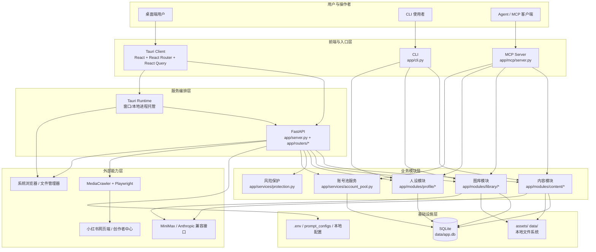
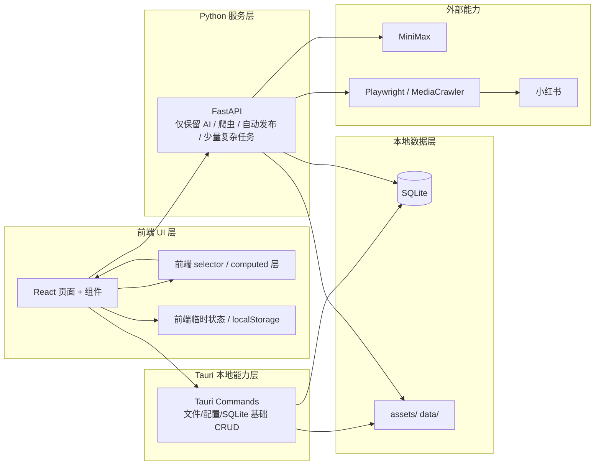
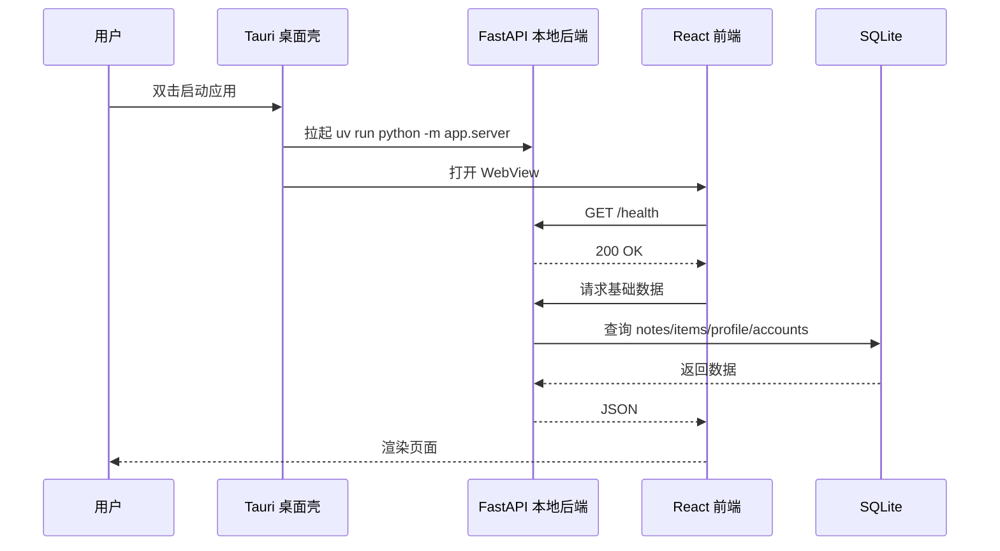
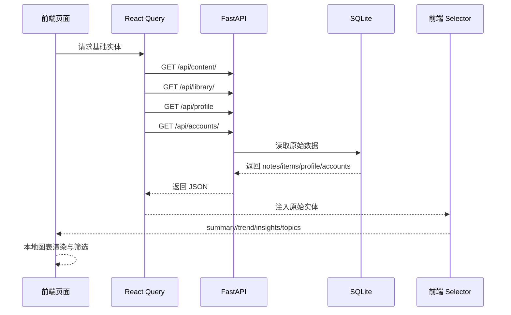
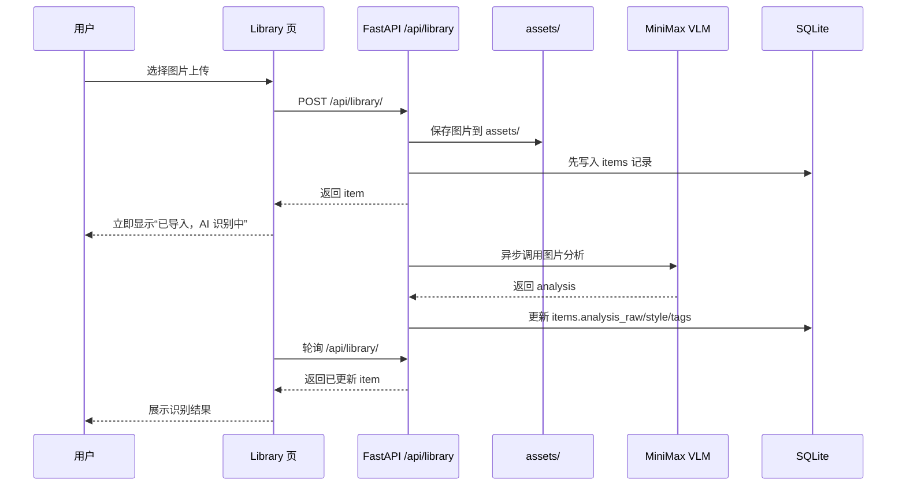
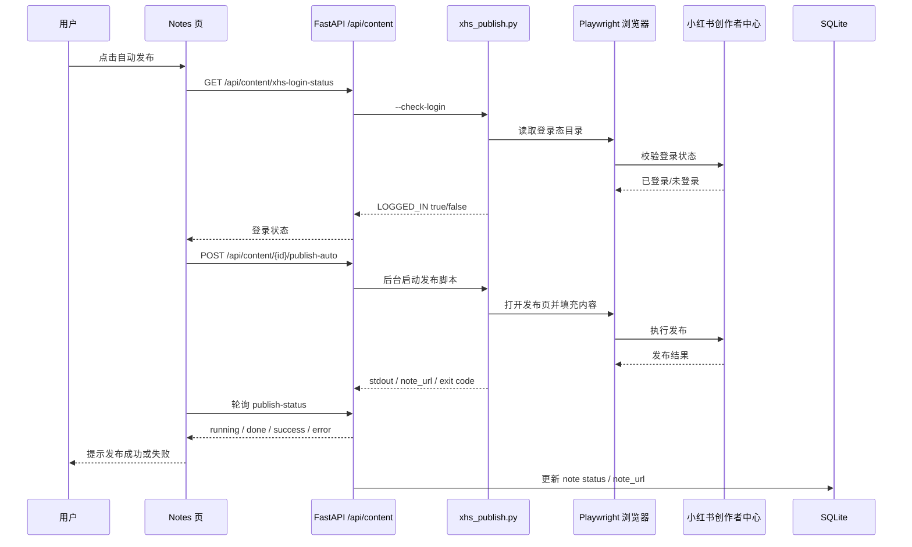
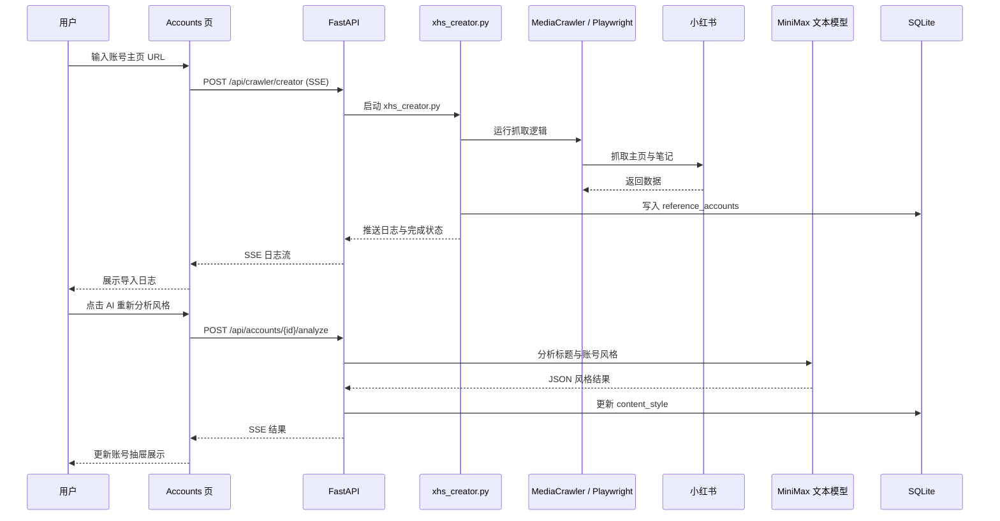

# 爱吃红薯整体技术架构与前端去接口化分析

> 适用版本：当前仓库主线（CLI + FastAPI + MCP + Tauri）
>
> 目标：梳理整项目技术挂钩关系，明确哪些能力适合前端化、哪些必须保留后端，并给出后续桌面端架构演进方向。

---

## 1. 文档目的

本项目当前采用四端共用一套业务与数据的架构：

- CLI：终端快速操作
- FastAPI：REST API 服务
- MCP Server：供 OpenCode / ClaudeCode 等 Agent 调用
- Tauri Client：桌面端 React GUI

随着桌面端打包与本地运行场景增多，项目逐渐暴露出两个结构性问题：

1. 前端对 HTTP API 依赖过重，很多原本可以在前端完成的聚合/筛选/格式化仍然走后端。
2. 本地桌面应用中，部分更适合通过 Tauri 原生命令完成的能力，仍被包装成 HTTP 接口。

本文件聚焦回答三个问题：

1. 当前项目的技术架构和模块挂钩关系是什么。
2. 哪些能力可以尽量前端化，减少接口调用。
3. 哪些能力必须保留在后端或系统能力层。

---

## 2. 总体架构

### 2.1 分层视图

### 2.2 关键结论

- React 前端当前几乎把所有业务都通过 `client/src/lib/api.ts` 打到 `http://127.0.0.1:8765`。
- FastAPI 不只是 CRUD 层，还承担了：
  - 数据聚合
  - 格式转换
  - AI 调用
  - 文件系统操作
  - 子进程调度
  - 风险保护拦截
- Tauri 目前主要承担桌面壳、窗口与本地进程托管，尚未成为真正的本地数据能力层。
- SQLite 与本地文件系统是项目的真实数据底座。

---

## 3. 核心目录与职责

### 3.1 前端层

核心目录：`client/src/`

主要职责：

- 路由与页面展示
- 表单编辑与临时状态
- 列表交互
- AI 面板呈现
- 上传/发布辅助流程的 UI 封装

核心页面：

- `pages/Dashboard.tsx`：运营看板
- `pages/Library.tsx`：图库管理
- `pages/Notes.tsx`：笔记列表与编辑
- `pages/Profile.tsx`：我的账号 / 人设信息
- `pages/Settings.tsx`：设置、提示词、回收站
- `pages/Data.tsx`：数据分析与经验库入口
- `pages/Accounts.tsx`：榜样账号与学习抽屉
- `pages/Inspire.tsx`：灵感梦工厂
- `pages/KnowledgeTab.tsx`：经验库四分区

统一 API 入口：

- `client/src/lib/api.ts`

### 3.2 后端 API 层

核心目录：`app/routers/`

主要 router：

- `library.py`：图库 CRUD、上传、回收站、图片读取
- `content.py`：笔记 CRUD、导出、发布辅助、自动发布
- `profile.py`：当前账号人设与主页爬虫刷新
- `accounts.py`：榜样账号 CRUD、风格分析、学习要点、仿写 prompt
- `analytics.py`：聚合统计接口
- `knowledge.py`：经验库规则/样本/灵感
- `crawler.py`：浏览器管理、榜样账号爬虫导入
- `settings.py`：`.env` 与快捷提示词
- `accounts_pool.py`：多账号池与激活上下文

### 3.3 业务模块层

核心目录：`app/modules/`

- `content/`：草稿生成、prompt 构建、导出
- `library/`：图片入库、图片分析、路径处理
- `profile/`：账号画像分析

### 3.4 基础设施层

- `app/db/connection.py`：SQLite 连接与迁移
- `app/db/schema.py`：数据库 schema
- `assets/`：图库图片
- `data/`：SQLite、发布暂存、抓取结果、本地运行时数据
- `.env`：AI 与路径配置

### 3.5 外部能力层

- MiniMax：文本生成、图像理解
- MediaCrawler：榜样账号、小红书搜索、发布自动化基础
- Playwright：浏览器登录态与自动发布
- 小红书创作者中心：真实发布目标

---

## 4. 当前技术挂钩关系

### 4.1 页面到接口的挂钩

#### Dashboard

前端调用：

- `GET /api/analytics/summary`
- `GET /api/analytics/notes-trend`

实际依赖源头：

- `notes`
- `items`
- `my_profile`
- `reference_accounts`

结论：

- 页面本身不需要独立的聚合接口。
- 只要前端已有基础实体列表，这里的大部分统计都可以在前端 selector 层完成。

#### Library

前端调用：

- `GET /api/library/`
- `POST /api/library/`
- `POST /api/library/{id}/analyze`
- `DELETE /api/library/{id}`
- `POST /api/content/draft`

结论：

- 上传、删图、AI 图片分析必须保留后端。
- 标签聚合、未识别过滤、分页/筛选、预览状态完全适合前端完成。

#### Notes

前端调用非常重，包含：

- `content` CRUD
- `library` 查询
- `profile` 读取
- `publish-auto` 轮询
- `stage-images` / `open-stage-dir`
- `xhs-login-status`

结论：

- 笔记持久化、图片暂存、自动发布必须保留后端。
- 搜索、排序、导出 markdown、复制文案拼装等可前端化。

#### Profile

前端调用：

- `GET/PATCH /api/profile`
- `GET /api/account-pool/protection/status`
- `GET /api/profile/refresh-status`
- `POST /api/profile/refresh`

结论：

- 表单临时状态是前端职责。
- 人设持久化和主页爬虫刷新仍必须保留后端。

#### Settings

前端调用：

- `.env` 配置
- 快捷提示词 CRUD
- 回收站管理

结论：

- HDR 这类纯前端显示设置应留在前端本地存储。
- `.env` 与回收站本质属于本地系统能力，不适合继续以纯 HTTP 形式长期存在，更适合未来迁到 Tauri command。

#### Data

前端调用：

- `GET /api/analytics/summary`
- `GET /api/analytics/notes`
- `GET /api/analytics/insights`
- `PATCH /api/content/{id}/stats`

结论：

- `Data` 是最适合前端去接口化的页面。
- 图表、排序、分桶、标签词频、对比分析都可以由前端从基础数据计算。

#### Accounts

前端调用：

- `accounts` CRUD
- `crawler/creator` SSE
- `accounts/{id}/analyze`
- `accounts/{id}/insights`
- `accounts/{id}/imitate`
- `knowledge/ref-samples`

结论：

- 榜样账号持久化、AI 分析、仿写 prompt、爬虫导入必须保留后端。
- `content_style` 的解析、关键词标签抽取、抽屉状态管理都应留在前端。

#### Inspire

前端调用：

- `library` 全量列表
- `accounts` 全量列表
- `analytics/insights`
- `ai/inspire` SSE
- `content` 保存

结论：

- 灵感页的素材洗牌、标签勾选、结构解析、相关图片推荐可以前端化。
- 生成动作与保存动作仍需要后端。

#### Knowledge

前端调用：

- `rules`
- `my-samples`
- `ref-samples`
- `inspirations`

结论：

- 经验库里“规则计算”其实是典型聚合逻辑，天然适合前端 selector。
- 启用状态、样本增删、灵感持久化仍需后端或未来的本地数据命令层。

---

## 5. 什么适合前端做，什么不适合

### 5.1 适合前端做的内容

#### 1. 聚合统计与图表计算

典型目标：

- 看板统计卡片
- 发布趋势
- 标题长度分桶
- 发布时间段分布
- 标签词频
- 热词候选
- 榜样对比展示

原因：

- 这些都是 `notes / items / profile / reference_accounts` 的派生结果。
- 没有额外 IO，不依赖文件系统与外部服务。

#### 2. 列表筛选、排序、分页

典型目标：

- Notes 页搜索/排序/状态筛选
- Library 页 tag/style/未识别过滤
- Accounts 页排序与快速筛选
- Data 页排行榜排序

原因：

- 页面交互敏感，放前端更顺滑。
- 避免后端重复维护多个参数组合。

#### 3. 导出与文本拼装

典型目标：

- markdown 导出
- 复制标题/正文/标签
- 发布页预览文本拼接
- AI 对话系统附加上下文的组装

#### 4. 编辑中的临时会话状态

典型目标：

- Inspire 页未保存结果
- 笔记编辑页未提交内容
- 弹窗/抽屉开关状态
- 选题池洗牌结果
- 多选状态

### 5.2 不适合前端做的内容

#### 1. 文件系统操作

必须保留在后端或 Tauri 命令：

- 图片上传落盘
- 回收站恢复/物理删除
- 打开文件夹
- 发布图片暂存
- 绝对路径 reveal

#### 2. 数据库持久化

必须有本地持久层承接：

- SQLite CRUD
- schema 迁移
- 多账号隔离

#### 3. AI 调用

必须保留在后端：

- API Key 保护
- 流式输出
- 模型失败重试
- 图片分析

#### 4. 爬虫 / 浏览器自动化 / 自动发布

必须保留在后端或独立 sidecar：

- Playwright
- MediaCrawler
- 登录态目录
- 发布轮询
- 风险保护

#### 5. 系统级配置

例如：

- `.env`
- 路径配置
- 本地浏览器目录

这类不适合作为 React 纯前端逻辑处理，更适合未来迁到 Tauri 本地命令层。

---

## 6. 推荐的能力边界重构

### 6.1 推荐目标架构

### 6.2 推荐三层职责划分

#### 前端

负责：

- 展示
- 聚合统计
- 筛选排序
- 导出拼装
- 会话态

#### Tauri 本地命令层

建议未来承接：

- SQLite 基础 CRUD
- `.env` 读写
- 文件夹/文件 reveal
- 打开本地目录
- 也可承接图片入库

#### Python 服务层

只保留真正复杂或需要独立运行时的能力：

- AI 文本/视觉调用
- SSE 流式生成
- 爬虫
- 自动发布
- 风险保护

---

## 7. 接口去留建议

### 7.1 优先可下沉到前端 selector 的接口

建议优先替换：

- `GET /api/analytics/summary`
- `GET /api/analytics/notes-trend`
- `GET /api/analytics/insights`
- `GET /api/analytics/topics`

前提：

- 前端已经拿到基础实体：
  - notes
  - items
  - profile
  - reference_accounts

建议新增前端目录：

- `client/src/selectors/analytics.ts`
- `client/src/selectors/topics.ts`
- `client/src/selectors/knowledge.ts`

### 7.2 适合从 HTTP API 迁到 Tauri command 的能力

建议中期迁移：

- `settings/env`
- `settings/prompts`
- `content/open-stage-dir`
- `library/trash/*`
- `library/image-raw / image path reveal`

原因：

- 它们本质是桌面本地能力，不应长期通过 localhost HTTP 自身调用。

### 7.3 必须长期保留后端的接口

必须保留：

- `ai/*`
- `crawler/*`
- `content/publish-auto`
- `content/xhs-login-status`
- `accounts/{id}/analyze`
- `accounts/{id}/insights`
- `accounts/{id}/imitate`
- `library/{id}/analyze`

### 7.4 页面级迁移矩阵

| 页面 | 当前主要接口 | 适合前端化 | 适合迁到 Tauri command | 必须保留后端 |
| --- | --- | --- | --- | --- |
| Dashboard | `analytics/summary`, `analytics/notes-trend` | 统计卡片、趋势数据、建议文案 | 无 | 无 |
| Data | `analytics/notes`, `analytics/summary`, `analytics/insights`, `content/{id}/stats` | 图表、分桶、排行、词频、洞察聚合 | 无 | `content/{id}/stats` 写回 |
| Inspire | `library`, `accounts`, `analytics/insights`, `ai/inspire`, `content` | 素材筛选、选题洗牌、结构解析、结果缓存 | 无 | `ai/inspire`, `content` 保存 |
| Library | `library/*`, `content/draft`, `content/draft/multi` | 搜索、筛选、分页、标签聚合、选中态 | 图片 reveal、回收站操作 | 上传、删图、AI 分析、草稿生成 |
| Notes | `content/*`, `library/*`, `profile`, `publish-*` | 搜索、排序、markdown 导出、复制拼装、编辑临时态 | 打开暂存目录、图片目录操作 | CRUD、暂存、登录检测、自动发布 |
| Accounts | `accounts/*`, `crawler/creator`, `knowledge/ref-samples` | 风格标签解析、排序、抽屉展示态 | 无 | CRUD、AI 分析、仿写、爬虫导入 |
| Profile | `profile/*`, `profile/refresh-status`, `account-pool/protection/status` | 表单态、脏数据比较、展示映射 | 无 | 保存、刷新、风险保护 |
| Settings | `settings/env`, `settings/prompts`, `library/trash/*` | 展示设置、本地偏好 | `.env`、prompt、trash、目录打开 | 无 |
| Knowledge | `knowledge/rules`, `my-samples`, `ref-samples`, `inspirations` | 规则计算、样本聚合、启发式排序 | 可选迁移为本地 CRUD | 样本持久化、灵感入库 |
| AccountPool | `account-pool/*`, `crawler/browser` | 过滤、分组、状态展示 | 浏览器打开/关闭、本地 user_data_dir 管理 | 账号切换与保护校验 |

### 7.5 接口去留矩阵

| 接口类型 | 典型接口 | 建议去向 | 原因 |
| --- | --- | --- | --- |
| 聚合统计接口 | `analytics/summary`, `analytics/notes-trend`, `analytics/insights`, `analytics/topics` | 前端 selector | 无额外 IO，完全由基础实体派生 |
| 基础 CRUD | `content/*`, `library/*`, `accounts/*`, `profile` | 过渡期保留 HTTP；中期可评估迁到 Tauri + SQLite | 当前改造成本最高，需要分阶段迁移 |
| 文件系统接口 | `open-stage-dir`, `library/trash/*`, 图片目录相关接口 | Tauri command | 属于桌面系统能力，不应长期走 localhost |
| 配置接口 | `settings/env`, `settings/prompts` | Tauri command | 本地配置读写更适合原生命令 |
| AI 接口 | `ai/*`, `library/{id}/analyze`, `accounts/{id}/analyze`, `imitate` | 保留后端 | 涉及密钥、流式响应、失败重试 |
| 自动化接口 | `crawler/*`, `content/publish-auto`, `xhs-login-status` | 保留后端 | 依赖 Playwright、MediaCrawler、子进程与登录态 |
| 风险保护接口 | 受 `X-Risk-Acknowledged` 保护的操作 | 保留后端 | 需要统一后端拦截与审计边界 |

---

## 8. 关键时序图

### 8.1 桌面端启动与本地后端托管时序

### 8.2 Dashboard / Data 页的推荐去接口化时序

> 目标：从“后端聚合统计”改成“前端读取基础实体后本地计算”。

### 8.3 图库上传与异步图片分析时序

### 8.4 自动发布时序

### 8.5 榜样账号导入与学习分析时序

---

## 9. 推荐改造路线

### 阶段一：先削减聚合接口

目标：

- 保留基础 CRUD
- 去掉后端统计接口
- 前端引入 selector 层

优先页面：

- Dashboard
- Data
- Inspire
- Knowledge 中的规则计算

### 阶段二：本地能力迁移到 Tauri command

目标：

- 减少“桌面应用自己调自己 HTTP API”的链路
- 把文件/配置/基础 SQLite 能力从 FastAPI 下沉到 Tauri

优先能力：

- `.env`
- prompt configs
- 打开目录/打开文件
- 回收站与物理文件删除

### 阶段三：Python 服务层收缩为“复杂能力后端”

目标：

- FastAPI 只保留 AI / crawler / publish / 风险保护
- 页面展示与普通 CRUD 尽量转移到前端 + Tauri 本地命令

### 阶段四：建议排期顺序

#### P0：低风险高收益

- 把 `Dashboard` 和 `Data` 的 `analytics/*` 改成前端 selector
- 把 `Knowledge` 中纯规则聚合逻辑移到前端
- 把 `Notes` / `Library` 的排序、筛选、分页彻底前端化

#### P1：桌面本地能力下沉

- 新增 Tauri commands 承接：
  - `.env` 读写
  - prompt 配置
  - 打开目录
  - trash 恢复/清空
- 前端新增本地能力访问层，和 `client/src/lib/api.ts` 分离

#### P2：收缩 Python HTTP 面

- 审视 `profile`、`accounts`、`library`、`content` 中纯本地 CRUD 是否值得继续走 HTTP
- 如果值得，设计 `SQLite repository + Tauri command` 的替代层
- 保留 Python 服务专注处理：
  - AI
  - crawler
  - publish
  - risk protection

---

## 10. 最终判断

当前项目最适合的演进方向不是“完全去后端”，而是：

1. **前端承担更多派生计算与展示逻辑**
2. **Tauri 承担本地文件/配置/SQLite 基础能力**
3. **Python 后端专注 AI、爬虫、自动发布等复杂运行时任务**

这样既能显著降低接口数量，又不会破坏项目最核心的桌面自动化能力。

如果要继续推进，建议下一步单独产出两份文档：

1. 《接口去留清单》
2. 《前端 selector 与 Tauri command 改造方案》

---

## 11. 参考文件

- 前端入口：`client/src/lib/api.ts`
- 桌面端：`client/src-tauri/src/lib.rs`
- 服务入口：`app/server.py`
- 统计聚合：`app/routers/analytics.py`
- 图库：`app/routers/library.py`
- 内容：`app/routers/content.py`
- 账号人设：`app/routers/profile.py`
- 榜样账号：`app/routers/accounts.py`
- 经验库：`app/routers/knowledge.py`
- 爬虫：`app/routers/crawler.py`
- 设置：`app/routers/settings.py`
- 数据库：`app/db/connection.py`, `app/db/schema.py`
- 爬虫脚本：`crawler/xhs_creator.py`, `crawler/xhs_publish.py`, `crawler/xhs_search.py`
